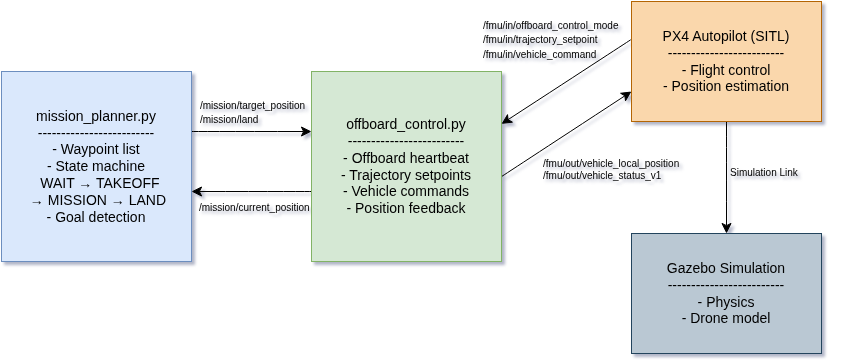
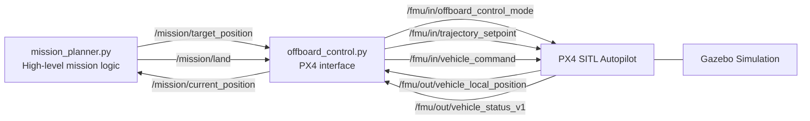

# 🚁 PX4 ROS2 Drone Autonomy with Waypoint Missions

## 📌 Project Overview

This project implements a **ROS2 (Python) + PX4 offboard control system** for autonomous drone navigation in simulation. The system enables a drone to **take off, follow a sequence of waypoints, and land autonomously**, using a clean separation between high-level mission planning and low-level flight control.

The architecture is designed to be modular and extensible. A **mission planner node** handles waypoint logic and decision-making, while an **offboard control node** manages communication with the PX4 autopilot. Mission parameters, including waypoints, are fully configurable through YAML files, making the system easy to adapt for different scenarios.

---

## 🎥 Demo


---

## 🧠 System Architecture



The system is designed with a clear separation between high-level mission logic and low-level flight control. The `mission_planner` node generates target waypoints and manages the mission state machine (takeoff, waypoint navigation, landing), while the `offboard_control` node handles all PX4-specific communication, including setpoint streaming, mode switching, and vehicle commands. This modular architecture allows the planner to remain independent of PX4 message details, making the system easier to extend with future capabilities such as perception, tracking, and dynamic mission updates.

---

## ✨ Features

* ✅ PX4 SITL + ROS2 integration using Micro XRCE-DDS
* ✅ Offboard control via ROS2 Python
* ✅ Autonomous mission execution:

  * Takeoff → Waypoints → Landing
* ✅ Clean architecture:

  * High-level mission planner
  * Low-level PX4 interface node
* ✅ ROS2 parameter system integration
* ✅ YAML-based mission configuration
* ✅ Launch file with selectable mission profiles
* ✅ Stable waypoint detection with hold-time logic
* ✅ NED frame consistency (PX4-compatible)

---

## 🧠 System Architecture

The system is composed of two main ROS2 nodes:

* **`mission_planner.py`**
  Handles high-level autonomy:

  * waypoint sequencing
  * state machine (TAKEOFF → MISSION → LAND)
  * goal detection and transitions

* **`offboard_control.py`**
  Handles low-level PX4 interaction:

  * offboard heartbeat
  * trajectory setpoint streaming
  * arm / mode switching / landing commands
  * publishes simplified position feedback

---

## 🔁 Data Flow



---

## ⚙️ Dependencies

* ROS2 Humble
* PX4 Autopilot (SITL v1.16.0 recommended)
* Gazebo (Harmonic / gz)
* Micro XRCE-DDS Agent
* QGroundControl
* `px4_msgs` ROS2 package

---

## 🚀 How to Run

### 1. Source environment

```bash
source ~/drone_ws/env_px4.sh
```
Which is basically followings:

```bash
export ROS_DOMAIN_ID=0
unset ROS_LOCALHOST_ONLY
```
---

### 2. Start Micro XRCE-DDS Agent

```bash
MicroXRCEAgent udp4 -p 8888
```

---

### 3. Start QGroundControl

```bash
./QGroundControl.AppImage
```
Installation:

```bash
wget https://github.com/mavlink/qgroundcontrol/releases/download/v4.3.0/QGroundControl.AppImage
```

---

### 4. Start PX4 SITL

```bash
cd ~/PX4-Autopilot
make px4_sitl gz_x500
```

---

### 5. Launch ROS2 nodes

```bash
ros2 launch drone_offboard_py mission.launch.py
```

---

## 🎯 Running Different Missions

You can select different missions at launch time:

```bash
ros2 launch drone_offboard_py mission.launch.py mission_file:=triangle_mission.yaml
```

---

## 🗺️ Mission Configuration

Mission parameters are defined in YAML files under:

```text
config/
```

Example:

```yaml
mission_planner_node:
  ros__parameters:
    takeoff_altitude: -5.0
    position_tolerance: 0.5
    hold_count_required: 10
    waypoints: [0.0, 0.0, -5.0, 5.0, 0.0, -5.0, 5.0, 5.0, -5.0, 0.0, 5.0, -5.0]
```

### 📌 Waypoint Format

Waypoints are defined in **PX4 local NED frame**:

```
[x1, y1, z1, x2, y2, z2, ...]
```

Each group of 3 values represents one waypoint.

* `x` → North
* `y` → East
* `z` → Down (negative = up)

---

## 🔄 Mission Workflow

The mission planner follows a finite state machine:

1. **WAIT_FOR_POSITION**
2. **TAKEOFF** → reach target altitude
3. **MISSION** → follow waypoint sequence
4. **LAND** → send PX4 land command
5. **DONE**

Waypoint transitions are validated using:

* distance threshold
* hold-time stabilization

---

## 🧪 Example Missions

* Square mission
* Triangle mission
* Custom waypoint sets via YAML

---

## 📁 Project Structure

```text
drone_offboard_py/
├── config/
│   ├── mission_params.yaml
│   ├── square_mission.yaml
│   ├── triangle_mission.yaml
│   └── offboard_params.yaml
├── launch/
│   └── mission.launch.py
├── drone_offboard_py/
│   ├── offboard_control.py
│   └── mission_planner.py
├── package.xml
├── setup.py
└── README.md
```

---

## 🔧 Key Concepts Demonstrated

* ROS2 publishers, subscribers, timers
* ROS2 parameters and YAML configuration
* DDS communication (Micro XRCE-DDS)
* PX4 offboard control requirements
* NED vs ENU coordinate systems
* Modular robotics architecture design

---

## 🚧 Future Work

Planned extensions for this project:

* 📷 Camera integration (Gazebo → ROS2 bridge)
* 🧠 Object detection (OpenCV / YOLO)
* 🎯 Target tracking
* 🔁 Mode switching:

  * Mission mode
  * Tracking mode
* 🗺️ Dynamic mission updates
* 🧩 Multi-node autonomy framework

---

## 🏁 Summary

This project demonstrates a complete pipeline for **drone autonomy using ROS2 and PX4**, with a strong focus on modularity, configurability, and real-world robotics architecture. It serves as a foundation for more advanced capabilities such as perception-driven navigation and intelligent mission control.
